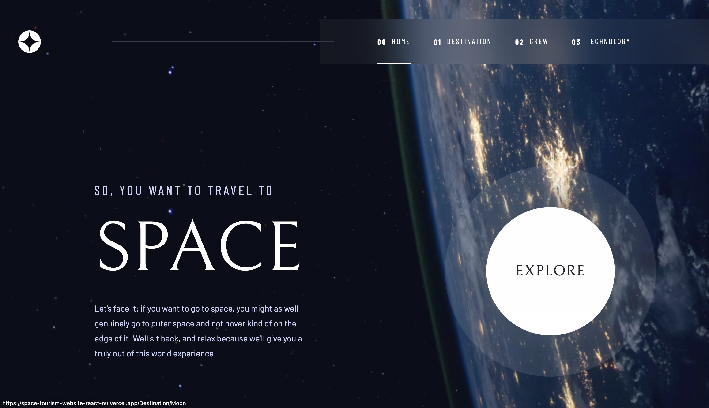

# Space-tourism-website

### Table of Contents

- [Prerequisites](#Prerequisites)
- [Tech Stack](#Tech-Stack)
- [Screenshot](#Screenshot)
- [Getting Started](#Getting-Started)
- [Project Structure](#Project-Structure)
- [Deployment](#Deployment)
- [Author](#Author)

#

### Prerequisites

-  _npm @8 and up_
-  \_typescript\_ @5.0.4
-  \_vite @4.0.0

#

### Tech Stack

-  _ReactJS @18.1.0 - frontend framework_
-  Styled-components @5.3.9 - visual primitives for the component age

#

### Screenshot

- 

#

### Getting Started

1. First of all you need to clone app repository from github:

```
git clone https://github.com/giorgisilagadze/space-tourism-website-React.git
```

2. Next step requires install all the dependencies.

```
npm install
```

3. To see project in action

```
npm run dev
```

#

### Project Structure

```
|--- src
|   |--- components # reusable components
|   |--- styled-components # all components' styles
|   |---|--- GlobalStyle
|   |--- App.jsx # main page
- data.json  # needful data for project
- package.json     # dependency manager configurations
- vite.config.js  # fast build tool
```

#

### Deployment

Before every deployment you need to create build file.

```
npm run build
```

after this you can use this file to deploy project on server.

#

### Author

- [LinkedIn](https://www.linkedin.com/in/giorgi-silagadze-3bb522257/)
